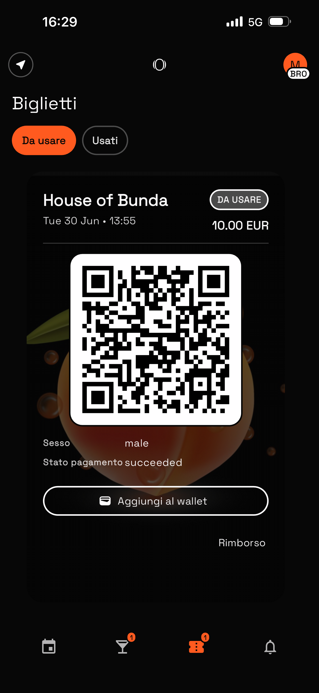
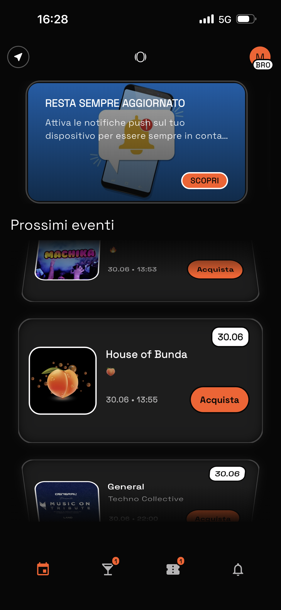
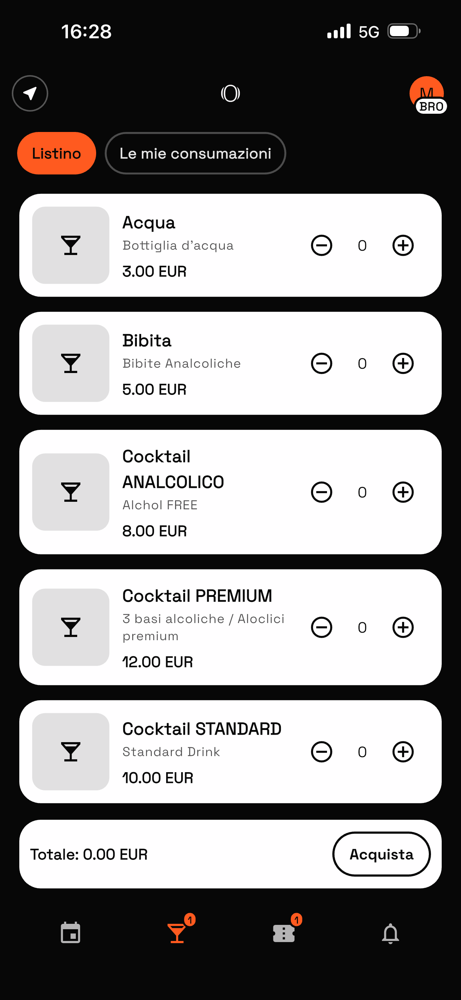
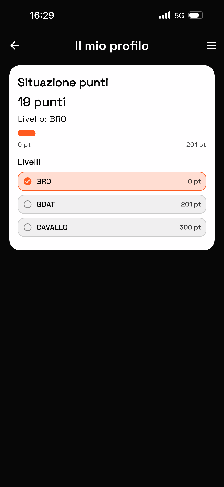
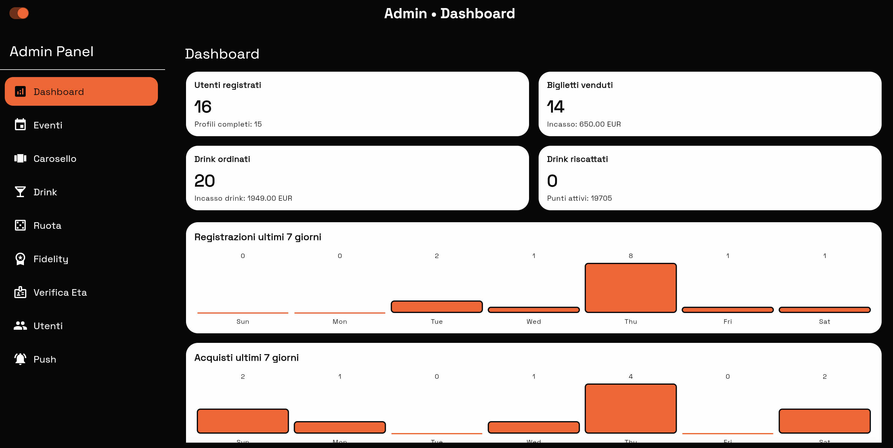

# myClub (myZero)

Piattaforma mobile Flutter + Firebase per locali/eventi con gestione completa di:

- ticket eventi,
- drink e consumazioni,
- verifica età,
- ruoli operativi,
- fidelity/livelli/premi,
- notifiche push,
- pannello admin multi-ruolo.

## Funzionalità principali

- Acquisto ticket e drink con Stripe.
- QR code per ingresso e bar con scanner operatori.
- Verifica età con revisione amministrativa.
- Ruoli: super admin, marketing/comunicazione, analyst, operatore ingresso, operatore bar.
- Ruota premi configurabile da backoffice.
- Profilo utente con stato punti/livelli e storico operativo.

## Screenshot

Galleria completa:

- [docs/screenshots/index.md](docs/screenshots/index.md)

## Documentazione

- Documento progetto completo: [docs/01_progetto_myclub_myzero.md](docs/01_progetto_myclub_myzero.md)
- Analisi costi/commissioni: [docs/02_costi_operativi_e_commissioni.md](docs/02_costi_operativi_e_commissioni.md)

## Stack

- Flutter (iOS, Android, Web)
- Firebase Auth / Firestore / Storage / Cloud Functions / FCM
- Stripe (pagamenti e fatture)
