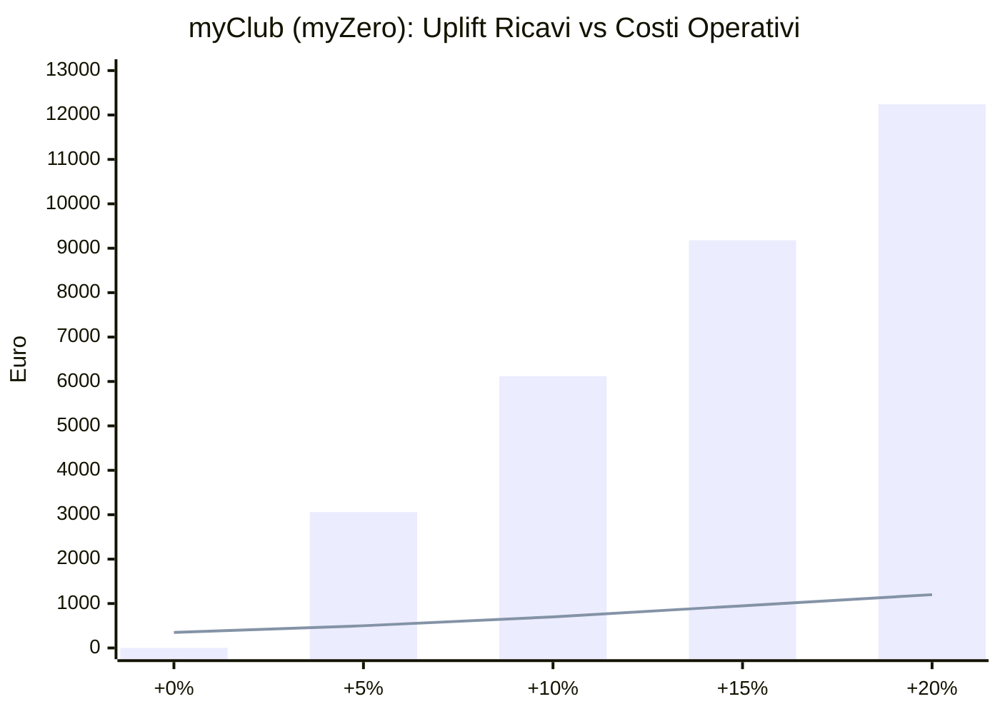

# myClub (myZero) — Analisi Costi (Google/Firebase + Stripe) e Convenienza

## Premessa importante

Questa simulazione usa:

- scenario richiesto: **100 utenti attivi al giorno**,
- pricing ufficiale Firebase/Google e Stripe disponibili al momento,
- ipotesi operative conservative e dichiarate.

I costi reali dipendono da:

- regione cloud,
- traffico reale,
- mix carte/metodi pagamento,
- volume download media/documenti,
- eventuali dispute/rimborsi.

---

## 1) Scenario di utilizzo simulato (100 DAU)

Ipotesi mensili (30 giorni):

- utenti attivi medi giornalieri: 100
- sessioni medie: 2 per utente/giorno
- eventi acquistati: 25 ticket/giorno
- ordini drink pagati: 55 ordini/giorno
- notifiche push inviate: 4.000/mese
- upload documenti verifica età: 4 richieste/giorno, 2 immagini da 3 MB ciascuna

Tradotto in volume:

- ticket/mese: ~750
- ordini drink/mese: ~1.650
- transazioni Stripe/mese stimate: ~2.400
- nuovi media età/mese: ~720 MB

---

## 2) Stima costi Google/Firebase (mensili)

## 2.1 Firestore

Con 100 DAU e query ottimizzate, il volume tipico resta spesso vicino o sotto il free tier Spark/Blaze iniziale (letture/scritture moderate).

Stima prudenziale Blaze (oltre free):

- **€5 – €25 / mese**

(variabile soprattutto con query admin, notifiche storiche, listing e scansioni operative).

## 2.2 Cloud Functions

Con ~2.400 pagamenti + callable operative + webhook:

- invocazioni e compute generalmente basse per questo traffico.

Stima:

- **€0 – €12 / mese**

## 2.3 Cloud Storage

Con i soli documenti età (~0,72 GB/mese) e immagini app ottimizzate:

- storage e download contenuti restano contenuti.

Stima:

- **€1 – €10 / mese**

## 2.4 Firebase Cloud Messaging

- Push mobile via FCM: normalmente senza costo diretto per i volumi di questo scenario.

Stima:

- **€0 / mese**

## 2.5 Totale Google/Firebase stimato

Range realistico per questo scenario:

- **~€6 – €47 / mese**

Range “operativo comodo” da mettere a budget:

- **~€25 – €60 / mese** (include margine sicurezza).

---

## 3) Commissioni Stripe (mensili)

## 3.1 Ipotesi economiche

- ticket medio: €20
- ordini drink medi: €28
- ticket/mese: 750 → €15.000 GMV
- ordini drink/mese: 1.650 → €46.200 GMV
- **GMV totale mese: €61.200**
- transazioni totali mese: 2.400

## 3.2 Fee standard carte (esempio EU/EEA online)

Formula tipica Stripe:

- commissione percentuale + quota fissa per transazione

Con riferimento standard comune (es. 1,5% + €0,25), stima:

- parte percentuale: €61.200 × 1,5% = **€918**
- parte fissa: 2.400 × €0,25 = **€600**
- **totale Stripe base: ~€1.518 / mese**

## 3.3 Costi aggiuntivi possibili

- carte non EEA, wallet, metodi alternativi: fee diverse
- dispute/chargeback: fee dedicate
- servizi opzionali (es. alcune funzioni avanzate billing)

Buffer prudenziale extra:

- **+€100 – €350 / mese**

## 3.4 Sintesi commissioni Stripe (senza totale aggregato)

Le commissioni Stripe vanno sempre lette come:

- componente percentuale su GMV,
- componente fissa per transazione,
- eventuali extra fee (carte non EEA, dispute, servizi opzionali).

Formula pratica:

- `FeeStripe ≈ (GMV × fee%) + (N_transazioni × fee_fissa) + extra_fee`

---

## 4) Costo piattaforma: impostazione corretta

Per evitare stime rigide eccessive, il costo finale va calcolato mese per mese con:

- costi Google/Firebase (quasi fissi a questi volumi),
- commissioni Stripe variabili in base a GMV e numero transazioni.

Formula:

- `CostoTotale = CostoGoogle + FeeStripe`

---

## 5) Perché conviene comunque (business case)

Il punto non è solo il costo: è il **delta ricavi** e il **delta margine** che l’app abilita.

Le leve che aumentano il fatturato:

- acquisto frictionless ticket/drink,
- campagne push profilate,
- loyalty e premi,
- riduzione “drop” al checkout,
- riattivazione utenti con notifiche.

### Simulazione incremento fatturato da fidelizzazione

Base GMV mese (scenario): €61.200

- +5% GMV: +€3.060
- +10% GMV: +€6.120
- +15% GMV: +€9.180
- +20% GMV: +€12.240

Anche considerando fee Stripe sull’incremento, il saldo resta ampiamente positivo.

---

## 6) Grafico convenienza (incremento GMV vs commissioni + costi operativi)

Lettura del grafico:

- **barre**: extra fatturato mensile da fidelizzazione
- **linea**: esempio di costo operativo progressivo (Google + commissioni Stripe), senza usare un totale fisso unico

Già con un incremento vicino al **+5%** il rapporto costo/beneficio è favorevole.

---

## 7) Formula rapida per il tuo controllo mensile

- `CostoTotale = CostoGoogle + FeeStripe`
- `FeeStripe ≈ (GMV × fee%) + (N_transazioni × fee_fissa)`
- `UpliftNetto ≈ (GMV × uplift%) - FeeStripe_su_uplift - eventuali promo`

Se `UpliftNetto > CostoTotale`, l’app è economicamente in vantaggio.

---

## 8) Raccomandazioni pratiche per massimizzare il ROI

- Ottimizza numero query/listing (riduce Firestore cost).
- Comprimi immagini e imposta retention documenti (riduce Storage).
- Spingi ordini drink multiprodotto in un unico checkout (riduce fee fisse Stripe).
- Usa campagne push ad alta conversione, non massive.
- Monitora KPI settimanali: conversione, AOV, riacquisto, redemption premi.

---

## 9) Fonti ufficiali prezzi (verifica sempre eventuali aggiornamenti)

- Firebase pricing: https://firebase.google.com/pricing
- Firestore billing example: https://firebase.google.com/docs/firestore/billing-example
- Firebase Cloud Messaging (overview): https://firebase.google.com/docs/cloud-messaging
- Stripe pricing (Italia): https://stripe.com/it/pricing
